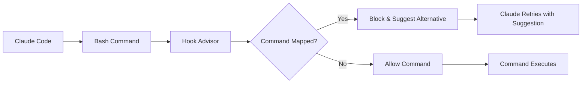

# Claude Hook Advisor Overview

## What is Claude Hook Advisor?

Claude Hook Advisor is a lightweight Rust CLI tool that integrates with Claude Code as a PreToolUse hook. It intercepts Bash commands that Claude Code attempts to execute and suggests better alternatives based on your project-specific preferences.

## 🎯 Key Benefits

### 1. **Consistent Tooling**
Ensure your entire team uses the same preferred tools across projects:
- Replace `npm` with `bun` for faster package management
- Use `bat` instead of `cat` for syntax highlighting
- Enforce `wget` over `curl` for consistency

### 2. **Automatic Command Translation**
No need to constantly remind Claude Code about your preferences:
- Claude tries to run `npm install` → Automatically suggests `bun install`
- Claude attempts `curl` → Automatically suggests `wget --verbose`
- Works seamlessly without interrupting your workflow

### 3. **Project-Specific Configuration**
Each project can have its own `.claude-hook-advisor.toml` file:
- Node.js projects can prefer `bun`
- Python projects can prefer `uv`
- Legacy projects can maintain their existing tooling

### 4. **Safety and Security**
Prevent dangerous commands and encourage best practices:
- Block `rm -rf` and suggest safer alternatives
- Encourage signed git commits
- Promote secure SSH practices

## 🔄 How It Works



1. **Command Interception**: When Claude Code tries to run a Bash command, the hook receives JSON input
2. **Configuration Loading**: The tool loads `.claude-hook-advisor.toml` from the current directory
3. **Pattern Matching**: Uses word-boundary regex to match commands against configured mappings
4. **Response Generation**: If a match is found, returns a blocking response with the suggested replacement
5. **Automatic Retry**: Claude Code receives the suggestion and automatically retries with the correct command

## 🛠️ Core Features

### Smart Pattern Matching
- Uses word-boundary regex to avoid false positives
- `npm` matches `npm install` but not `npm-check`
- Supports exact command matching and partial matching

### Flexible Configuration
- Simple TOML configuration format
- Support for complex command replacements
- Environment-specific configurations

### Zero-Overhead Integration
- Only activates when commands match your mappings
- Minimal performance impact
- No changes to your existing workflow

### Rich Error Handling
- Clear error messages when configuration is invalid
- Graceful fallback when config files are missing
- Detailed logging for troubleshooting

## 🎯 Use Cases

### Package Manager Standardization
```toml
[commands]
npm = "bun"
yarn = "bun"
npx = "bunx"
```

### Modern CLI Tool Adoption
```toml
[commands]
cat = "bat"
ls = "eza"
grep = "rg"
find = "fd"
```

### Security Enforcement
```toml
[commands]
"rm -rf" = "echo 'Use trash command for safety'"
"chmod 777" = "echo 'Consider more restrictive permissions'"
```

### Development Workflow Optimization
```toml
[commands]
"npm start" = "bun dev"
"npm test" = "bun test --watch"
"git commit" = "git commit -S"
```

## 🏗️ Architecture Highlights

- **Single Binary**: Compiled Rust binary with no external dependencies
- **Fast Startup**: Optimized for quick hook execution
- **Memory Efficient**: Minimal memory footprint
- **Cross-Platform**: Works on Linux, macOS, and Windows

## 🔗 Integration Points

### Claude Code
- Integrates as a PreToolUse hook
- Supports both project-specific and global configurations
- Works with Claude Code's hook protocol

### Development Tools
- Compatible with any command-line tool
- Works with package managers, build tools, and utilities
- Supports complex command transformations

### Project Workflows
- Integrates with existing development workflows
- No changes required to existing scripts or processes
- Transparent to team members

## 🚀 Getting Started

Ready to enhance your development workflow? Check out our [Installation Guide](installation.md) to get started, or jump to the [Quick Start](quick-start.md) for a 5-minute setup.

---

**Next Steps:**
- [Install Claude Hook Advisor](installation.md)
- [Configure your first project](configuration.md)
- [Set up Claude Code integration](claude-integration.md)

#claude-code #hooks #productivity #development-tools #automation